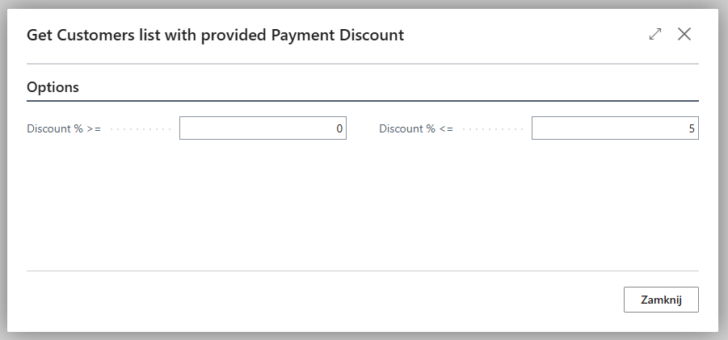
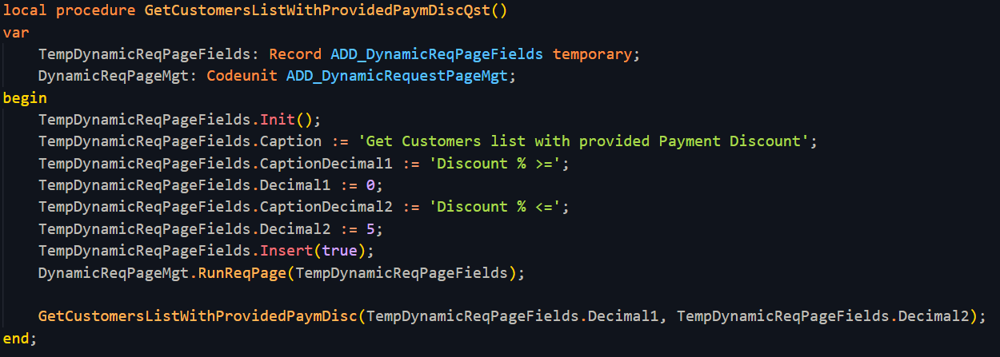

# Dynamic Request Page
 The extension adds a new page that can serve as a dynamic request page with all possible field types.
 You can use this single page in most scenarios where the user needs to enter some data, without having to create a new object just to collect values from the user.
 
 Example:
 

 
 To use it, simply set the captions for the required fields and run the RunReqPage procedure.
 Optionally, you can set default values.
 
 
